## Geographic quiz,
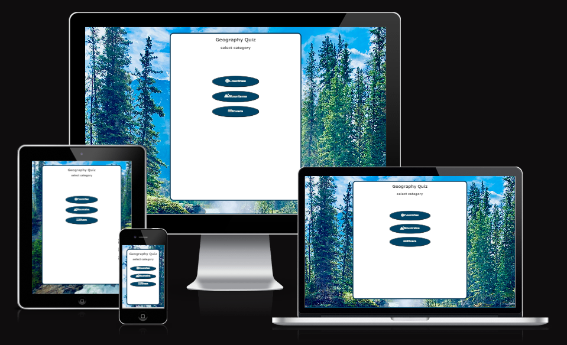
 
Our project is a Quiz with a selection of categories which you can select to be taken to a five question quiz on the selected subject.  On completion you will pass to a end screen congratulating you on your score and offering you a button to play again which will take you back to the catagory selector.
 
This quiz covers a broad spectrum of geographical knowledge, testing participants' familiarity with various countries, significant rivers, and prominent mountain ranges. Each category includes a mix of easier and slightly more challenging questions to cater to a wide range of skill levels.

## Wire frames
Our wire frame of the category selecter, we decided later to align the buttons in a column in all screensizes for consistentcy:
 
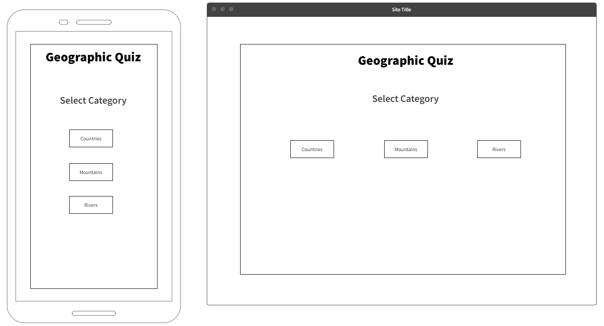
 

Our Wire frame for the quiz page:
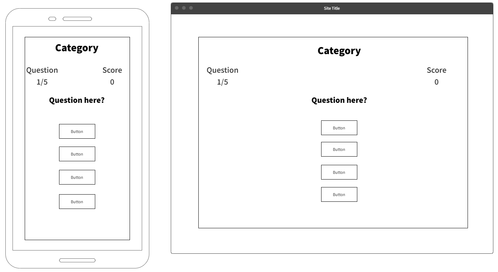
 

Our Wire frame for the end page:
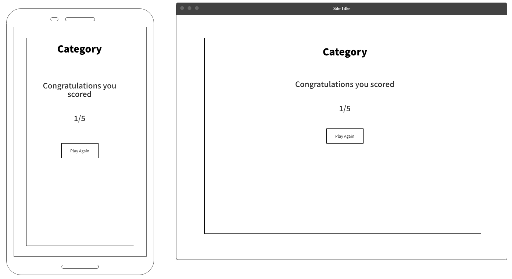
 

## Features / User Stories

As a user, I want a welcome screen, so that I know what the quiz game is about and can choose to start a round.
 
As a user I want the categories to set questions specific to the selected field, so I can play the quiz I selected.
acceptance criteria:
 
-Title
 
-Start button for each category
 
-easy to navigate
 
-responsive
 
-the categories display different question arrays depending on selection
 
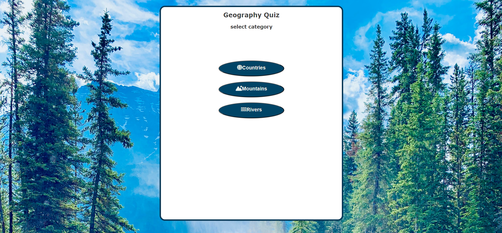
 

As a user I want multiple choice questions with buttons to select my answers and clear questions.
 
As a user I want at least 4 or 5 questions per category, so that I can test my general knowledge.
 
Acceptance criteria:
 
-neat display of quiz container showing:
 
* the category title
* the question
* the 4 buttons for answers with the answers in them

 
-5 history questions
 
-5 geography questions
   
-5 cultural questions
 

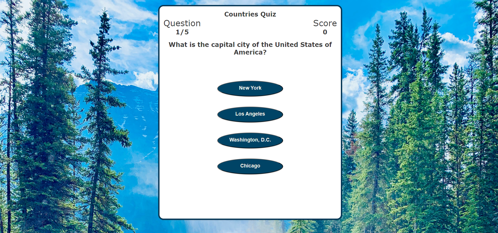

As a user I want a progress display and a score display so that I can see how far through I am and how I am doing.
 
As a user I want the progress section and the score section to increment as appropriate so I can see my progress in real time.
 
Acceptance criteria:
 
-Progress display
 
-score display
 
-score increments when correct answer selected
 
-progress bar increments after each question
 
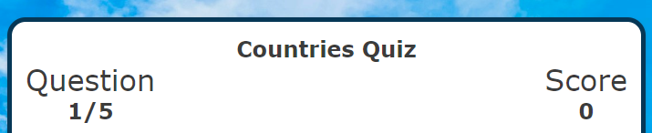
 

As a user I want new questions for each round that don't repeat within the round.
 
Acceptance criteria:
 
-quiz iterates through set number of questions without repeating
 
-questions and answers show in the html
 

As a user I can see whether the answer that I have given was correct so that I can learn from my mistakes.
 
acceptance criteria:
 
-displays if answer if answer is incorrect or correct
 

As a user I want an end page to display how I did and let me go back to the the start/welcome page
 
acceptance criteria:
 
-header shows which category you were playing
 
-shows score
 
-button to return to start page
 
-hidden when not in use
 
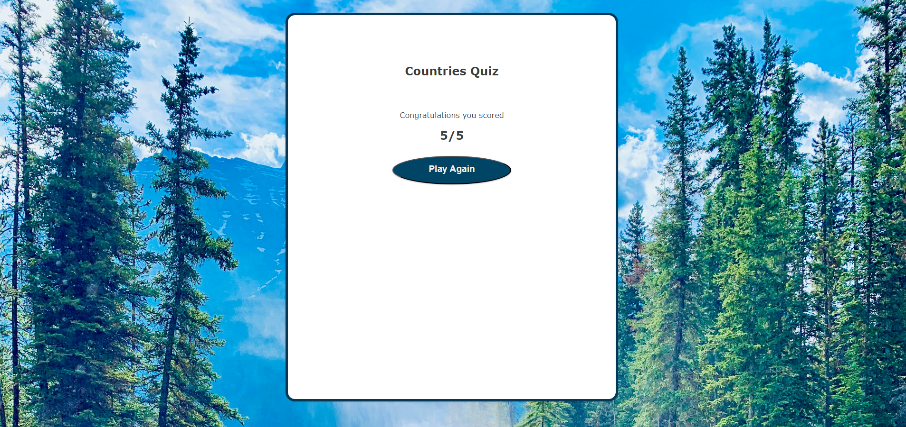
 

## Testing 
*Testing / Bugs*

We faced multiple bugs within this project, below are several noteworthy examples and how we fixed them:
 
-Only one of the category buttons working, the other two cases in the switch statement weren't running, so the quiz section would only display for the first catagory. we moved the loadGame() function after the switch statement, which fixed the issue.
 

-The quiz was stopping midway through the 5 questions and refusing to proceed to the next question as it was trying to run the displayFinalScore() function and displaying the following error : Uncaught ReferenceError: displayFinalScore is not defined
    at incrementScore (scripts.js:245:1)
    at HTMLButtonElement.<anonymous> (scripts.js:229:9)
This function had yet to be written as we were still working on the main quiz section. We had called the function in the incrementScore() function instead of the getNewQuestion() function.
 

-The quiz would restart with the final score of the previous round displaying, we tried to reset score to 0 in Javascript but the game continued to show the previous score until a point was scored in the new round. We fixed this by resetting the innerText of the score element in the playAgain() function
 

*Validation*
 

Validating the CSS found no errors : This document validates as CSS level 3 + SVG !
 

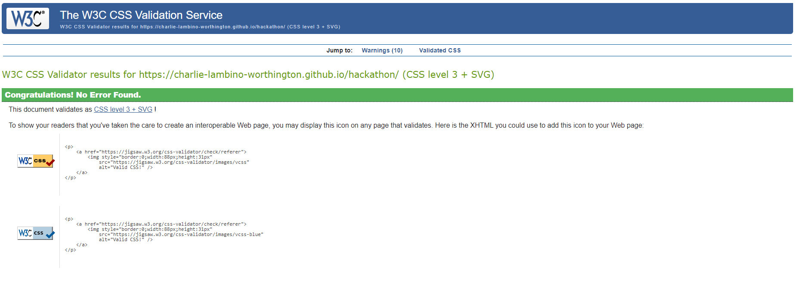
 

Validating the HTML Found a couple of instances of repeated use of an id all of which we changed for classes.
 
It also found a stray div closing element which was removed.
 
As well as multiple warnings for empty heading elements, which are there to be filled using the javascript and were put there purposefully.
 

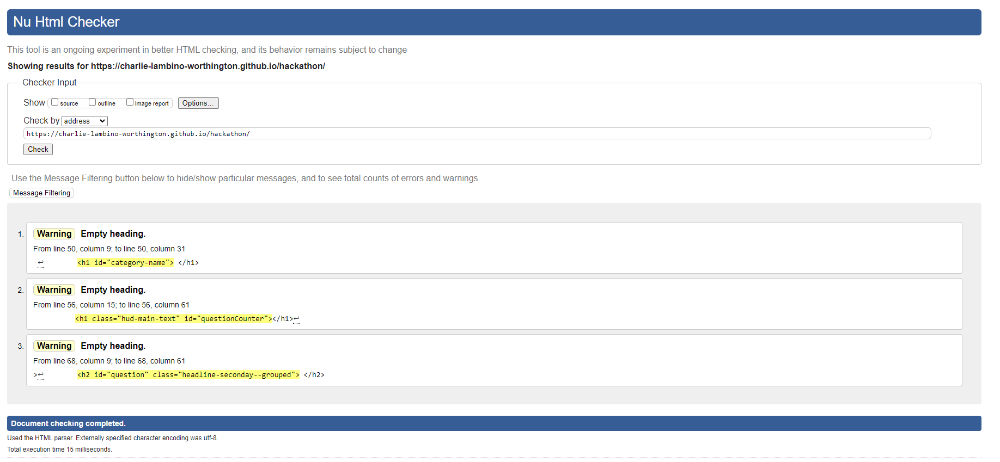
 

Validating the JavaScript found several missing semi-colons which have been added.
 
It also had warnings such as:
	'const' is available in ES6 (use 'esversion: 6') or Mozilla JS extensions (use moz).
  'let' is available in ES6 (use 'esversion: 6') or Mozilla JS extensions (use moz).
'arrow function syntax (=>)' is only available in ES6 (use 'esversion: 6').
'spread operator' is only available in ES6 (use 'esversion: 6').
	['number'] is better written in dot notation.
   
Which have not been rectified as it would require a complete rewrite and they are not breaking functionality.
 
It also found: One undefined variable incrementScore, which has been left due to time constraints as it is not breaking functionality.
 
As well as two unused variables selectCategory and	playAgain Which are called in the html rather than the Javascript which we believe to be why they are reading as unused, since they are working in live testing.

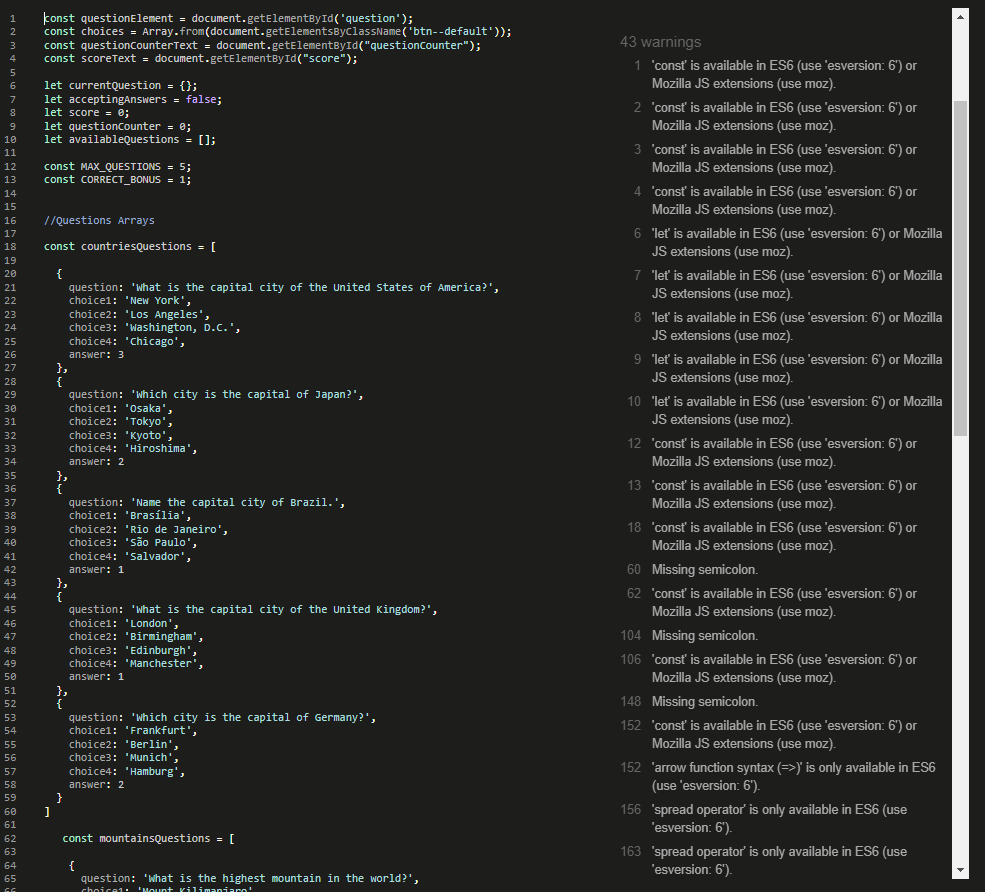
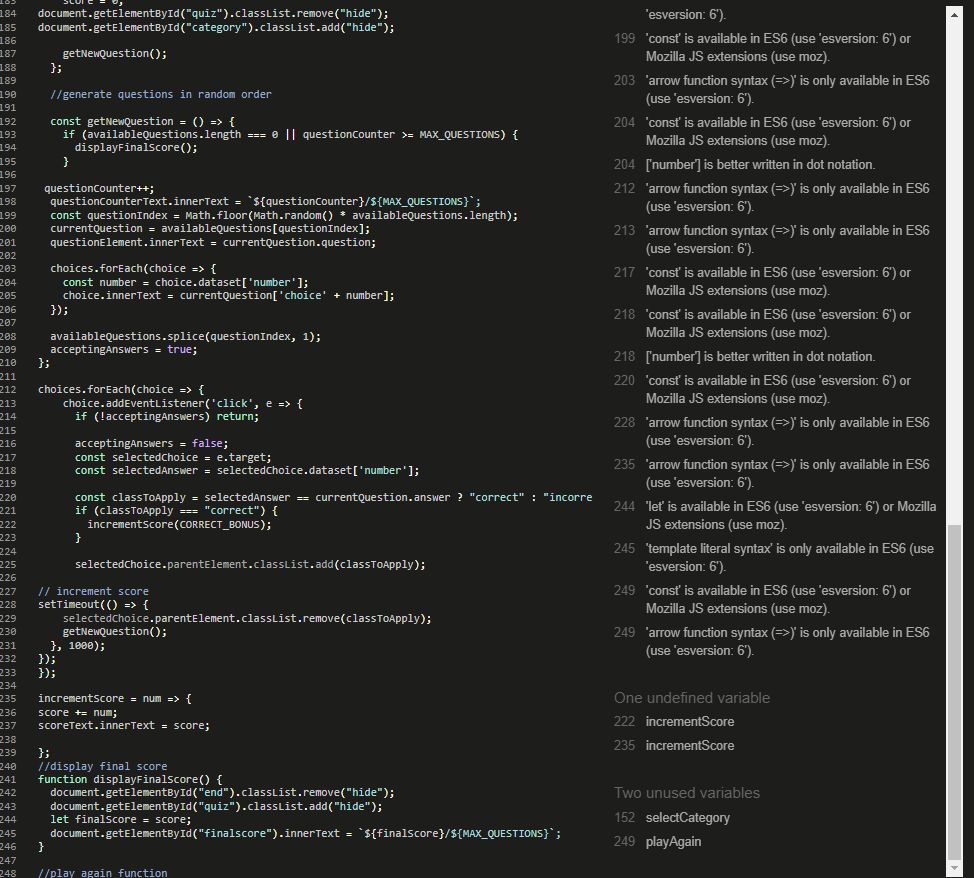

## Deployment

In this section, the tested and validated product will be deployed and external resources used during this exercise will be mentioned.

Final Product
 

 
The product is live and can be seen on [url of deployed site]
Category selection Page:
 
https://charlie-lambino-worthington.github.io/hackathon/

Kanban Board
 

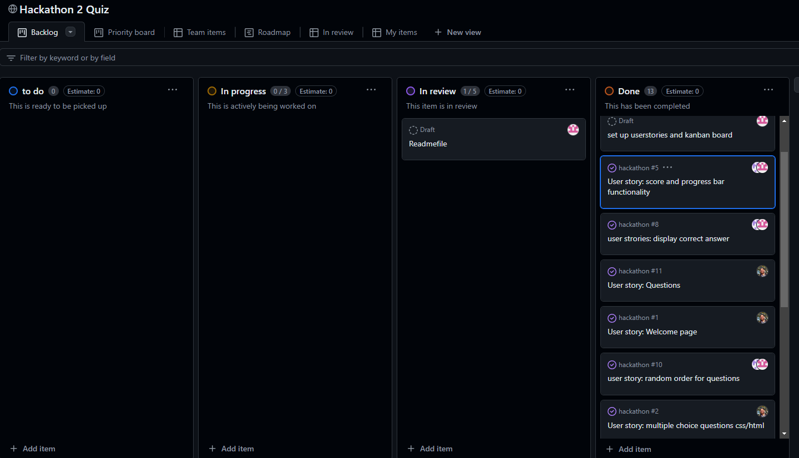
 

Our Kanban board shows the distribution of tasks beween our 3 team members. It is linked here: https://github.com/users/Charlie-Lambino-Worthington/projects/2

along with our repository link :
  
https://github.com/Charlie-Lambino-Worthington/hackathon

## Credits 

*Content*

-The icons for the category buttons were sourced from Font Awesome.
 
-The questions for the Quiz were sourced using chatgpt.
 
-Instructions and inspiration on how to implement a quiz game was taken from James Q Quick on YouTube, with his series Build a Quiz App with HTML, CSS, and JavaScript linked below:   https://www.youtube.com/playlist?list=PLDlWc9AfQBfZIkdVaOQXi1tizJeNJipEx
 
-inspiration for how to use a switch statement to change categories was taken from Moo ICT on youtube with his video Make a Character Selection project using HTML CSS and JavaScript linked below:
 
https://www.youtube.com/watch?v=ISeyrczkzGY

*Media*

The pbackground image used on this game is sourced from Unsplash.  green pine trees on rocky mountain under blue sky during daytime. this free HD photo of canada, athabasca falls, improvement district no. 12, and ab in Canada by Accolade Creative (@accolade) :
 
https://unsplash.com/photos/green-pine-trees-on-rocky-mountain-under-blue-sky-during-daytime-nkWteg-4-5c
